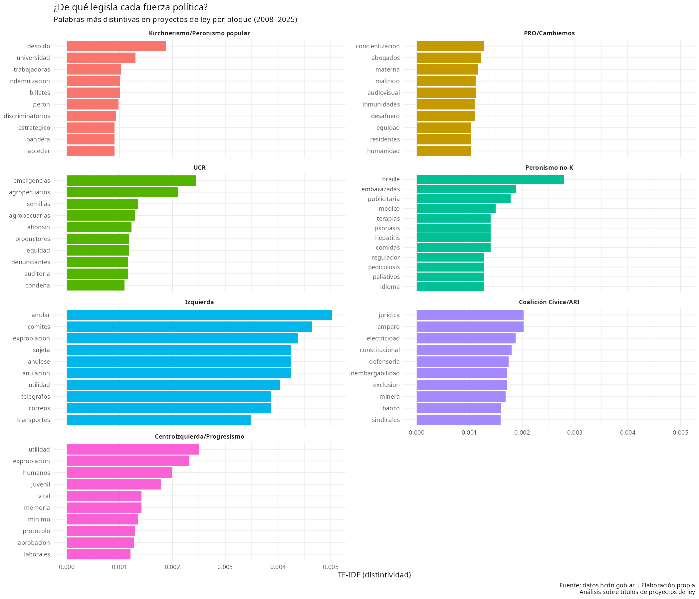

# Análisis de lenguaje político en proyectos de ley argentinos (2008–2025)
Análisis de vocabulario político en proyectos de ley argentinos (2008-2025) usando TF-IDF en R

## Descripción

Análisis de vocabulario político en 38.106 títulos de proyectos de ley 
presentados en la Cámara de Diputados de Argentina entre 2008 y 2025.

El análisis identifica qué palabras distinguen legislativamente a cada 
fuerza política usando TF-IDF (Term Frequency-Inverse Document Frequency),
una técnica estándar en lingüística computacional y ciencias sociales 
computacionales.

## Pregunta de investigación

¿De qué habla realmente el Congreso argentino — al menos en lo que declara 
públicamente cuando presenta una ley?

## Fuentes de datos

- **Proyectos parlamentarios**: datos.hcdn.gob.ar (112.793 registros, 2008–2026)
- **Composición histórica de la Cámara**: Dirección de Información Parlamentaria, 
  *Composición de la Honorable Cámara de Diputados de la Nación, 1983–2025*

## Metodología

### Preprocesamiento (Python)
- Limpieza del CSV original con formato irregular (doble anidamiento, 
  HTML entities corruptas)
- Tasa de recuperación: 97,9% (110.480 de 112.793 registros)
- Script: `limpiar_proyectos.py`

### Matching de bloques parlamentarios (Python)
- Extracción de datos históricos de composición de la Cámara desde PDF (465 páginas)
- Construcción de tabla de lookup: autor + año → bloque parlamentario
- Tasa de match: 90,1% de los proyectos con bloque asignado

### Análisis de texto (R)
- Filtro por tipo de proyecto: solo leyes (38.106 registros)
- Tokenización de títulos con `tidytext`
- Eliminación de stopwords en español + stopwords parlamentarias específicas
- Cálculo de TF-IDF por familia política con `bind_tf_idf()`
- Script: `analisis_parlamentario.R`

### Clasificación de familias políticas
Los bloques parlamentarios fueron agrupados en 8 familias políticas 
validadas manualmente:

| Familia | Bloques principales |
|---|---|
| Kirchnerismo/Peronismo popular | FPV-PJ, Frente de Todos, Unión por la Patria |
| PRO/Cambiemos | PRO, Unión PRO |
| UCR | UCR, UCR-Unión Cívica Radical, Evolución Radical |
| Coalición Cívica/ARI | CC y variantes |
| Peronismo no-K | Peronismo Federal, Frente Renovador (hasta 2019), Compromiso Federal |
| Centroizquierda/Progresismo | Partido Socialista, GEN, Libres del Sur, Proyecto Sur |
| Izquierda | FIT y variantes, PTS, Partido Obrero |
| La Libertad Avanza | La Libertad Avanza, Avanza Libertad |

**Nota sobre el Frente Renovador**: clasificado como Peronismo no-K hasta 
2019 y como Kirchnerismo/Peronismo popular desde 2020, cuando se integró 
al Frente de Todos.

**Nota sobre Federal Unidos por una Nueva Argentina (FUNA)**: reclasificado 
de PRO/Cambiemos a Peronismo no-K. Agrupa legisladores peronistas que apoyaron 
al gobierno de Cambiemos sin pertenecer orgánicamente al PRO.

**Nota sobre UCR y CC/ARI**: se mantienen como familias separadas de PRO/Cambiemos 
pese a integrar la coalición Cambiemos (2015-2023) porque mantuvieron bloques 
parlamentarios formales propios. Sus perfiles TF-IDF son empíricamente distinguibles 
del PRO incluso en los años de coalición compartida.

## Limitaciones

- El análisis es sobre **títulos**, no sobre el contenido de los proyectos
- El 9,9% de proyectos no tiene bloque asignado (senadores en Diputados, 
  comisiones bicamerales, variantes de nombre)
- La Libertad Avanza cuenta con 138 proyectos de ley (2024–2025), 
  insuficientes para el análisis TF-IDF comparativo
- Las versiones taquigráficas de los debates no están disponibles 
  como datos abiertos sistematizados

## Resultado principal

## Herramientas

- **R** con tidyverse, tidytext, ggplot2, scales
- **Python** con pandas, pdfplumber, csv

## Contexto

Este proyecto fue desarrollado como ejercicio de aplicación a partir del 
taller *Primeros pasos en análisis de datos para ciencias sociales con R*, 
parte de la Diplomatura en Ciencias Sociales Computacionales (UFLO/UCA).

## Autor

Nahuel Dreher — Analista de Datos & BI | Trabajo Social (UBA)  
[LinkedIn](https://www.linkedin.com/in/nahuel-dreher-00594a22a/)

